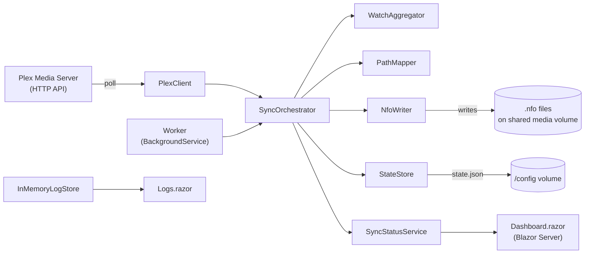

# Architecture

This document describes how PlexToJellyfinSync is put together and, where the reasoning is
recoverable from the code or existing docs, *why* it looks the way it does. It complements
[`README.md`](../README.md) (setup and configuration), [`CONTRIBUTING.md`](CONTRIBUTING.md)
(workflow) and [`UNIT_TESTS.md`](UNIT_TESTS.md) (test conventions) rather than repeating them.

---

## High-level shape

A single process ships as one Docker image: an ASP.NET Core / Blazor Server host whose only
background job is the `Worker` hosted service. There is no separate API tier, database, or
message queue — configuration, state, and in-memory status/log buffers are all the persistence
the application needs.

Project references form a straight line, `Core ← Data ← Service ← host`, except the host project
depends on `Core` and `Service` but **not** on `Data` directly — the Plex JSON DTOs never need to
be visible outside `PlexToJellyfinSync.Service`, which is the only project that talks to the Plex
API. Every project links the same `src/GlobalSuppressions.cs` (SonarCloud suppressions for
`S1125`, `S2325`, `S1244`, `S6968`) rather than each carrying its own.

The solution file is `.slnx` rather than the legacy `.sln` format — this is the current Visual
Studio standard for solution files, not a migration artifact.

---

## Sync pipeline

1. **`Worker`** (`src/PlexToJellyfinSync/Worker.cs`) is the only `BackgroundService`. On startup
   it runs one reconcile immediately (`SafeReconcileAsync`, errors logged and swallowed so a
   failed first reconcile does not crash the host), then loops: wait `Sync:PollIntervalSeconds`
   (minimum 5s), call `ISyncOrchestrator.ProcessHistoryAsync`, and — once
   `Sync:FullReconcileIntervalHours` (minimum 1h) has elapsed since the last reconcile — call
   `ISyncOrchestrator.ReconcileAsync` again. The loop is a plain `while` with `Task.Delay`, not a
   `PeriodicTimer`; overlapping runs cannot occur because each iteration awaits the previous sync
   call to finish before scheduling the next delay.
2. **`SyncOrchestrator`** (`src/PlexToJellyfinSync.Service/SyncOrchestrator.cs`) implements both
   sync strategies:
   - **`ProcessHistoryAsync`** (incremental, cheap, runs every poll) reads the persisted
     high-water mark from `IStateStore`, calls `IPlexClient.GetHistorySinceAsync` for entries
     newer than that mark for the configured owner account, writes/updates the NFO for each
     affected item via `WriteItemAsync`, then advances the high-water mark to the latest
     `ViewedAt` seen. On the very first run (no persisted high-water mark yet), it seeds the mark
     to "now" and returns without processing anything — this deliberately avoids replaying the
     owner's entire watch history as a flood of NFO writes on first startup.
   - **`ReconcileAsync`** (full, expensive, runs on startup and periodically) walks every
     configured Plex library (filtered by `Plex:Libraries` if set) and writes/updates the NFO for
     every movie or episode found, regardless of watch state. This is the catch-up path for
     changes `ProcessHistoryAsync` cannot see — for example items marked watched through means
     that do not produce a Plex history entry. The filtered libraries themselves are reconciled
     concurrently, bounded by `Sync:LibraryReconcileParallelism` (`Parallel.ForEachAsync`, minimum 1
     — a configured value below that is clamped rather than rejected), so wall-clock reconcile time
     scales with the slowest library instead of the number of libraries. Within a series library, a
     show's episode writes run concurrently, bounded by `Sync:EpisodeReconcileParallelism`
     (`Parallel.ForEachAsync`, minimum 1, clamped the same way); shows themselves are still
     reconciled one at a time within their library. Episodes that share a file (a multi-episode file
     such as `S01E01-E02.mkv` maps to one NFO target) are grouped and written sequentially within
     that group so two concurrent writers never race on the same target's temp file. A library's
     items are streamed from Plex page by page (`IAsyncEnumerable<MediaItem>`, see point 4) rather
     than being materialized up front, so peak memory is bounded by a single page instead of the
     whole library; the trade-off is that a later page is only requested once every item from the
     pages already streamed has been reconciled, so a library change during a long-running
     reconcile can be seen by one page and missed by another until the next scheduled reconcile,
     and a failure fetching a later page still leaves the items already streamed from earlier pages
     written. A show's episodes are still collected in full (`ToListAsync`) before being grouped by
     file, since that grouping needs every episode at once; peak memory there is bounded by one
     show's episode count rather than the whole library.
   - Both paths funnel through `WriteItemAsync`, which resolves the local path via `IPathMapper`
     and skips the item (with a log warning) if no mapping matches or the item has no file path.
   - When `Sync:WriteSeriesSeasonAggregates` is enabled, both paths additionally call
     `UpdateSeriesAggregatesAsync` for every show touched by the run: it re-fetches all episodes of
     that show, aggregates their `WatchInfo` per season and for the whole series via
     `WatchAggregator`, and writes `season.nfo` / `tvshow.nfo` next to the episode files.
   - Both entry points catch and log unexpected exceptions (`HandleError`) rather than letting
     the `Worker` loop die, and always reset `SyncStatusViewData.IsRunning` in a `finally` block.
     `OperationCanceledException` is re-thrown only when the run's `CancellationToken` was actually
     cancelled, so host shutdown is not swallowed as an error, while an `OperationCanceledException`
     raised by an HttpClient timeout on an upfront Plex request (history, libraries) is recorded
     through `HandleError` like any other failure.
   - Within a run, every per-item call (writing a history entry's item, a reconciled movie or
     episode, or a show's season/series aggregates) is additionally wrapped in its own try/catch
     (`HandleItemError`) so one poisoned item — a read-only media directory, an I/O error, a
     transient Plex timeout — does not abort the rest of the loop. Such a failure is counted in
     `SyncStatusViewData.Errors` without clearing `PlexConnected`, and in `ProcessHistoryAsync` the
     high-water mark still advances past the failing entry; the item's watch state is only
     recovered on the next `ReconcileAsync` run.
3. **`WatchAggregator`** (`src/PlexToJellyfinSync.Service/WatchAggregator.cs`) has one job:
   given a collection of `WatchInfo`, return `Watched = true` only if every child is watched, and
   `LastPlayed` as the maximum across children — but only when every child is watched; a partially
   watched aggregate always reports `LastPlayed = null`, so the two fields never contradict each
   other. It is the single source of truth for how season- and series-level watch state is derived
   from episodes.
4. **`PlexClient`** (`src/PlexToJellyfinSync.Service/PlexClient.cs`) is the only component that
   talks to the Plex HTTP API (`GET /accounts`, `/library/sections`,
   `/status/sessions/history/all`, `/library/metadata/{key}`, `/library/metadata/{key}/allLeaves`,
   `/library/sections/{key}/all`). It maps the raw `PlexToJellyfinSync.Data.Plex` DTOs
   (`PlexMetadata`, `PlexDirectory`, …) into the domain model (`MediaItem`, `PlexLibrary`,
   `PlexHistoryEntry`, `WatchInfo`) used by the rest of the app, so Plex's JSON shape never leaks
   past this class. `GetEpisodesAsync` and `GetLibraryItemsAsync` return `IAsyncEnumerable<MediaItem>`
   and request each further page of `X-Plex-Container-Start`/`-Size` lazily, only once the caller has
   consumed the previous page's items, instead of fetching and buffering every page before returning
   (see the reconcile trade-off in point 2). `GetOwnerAccountIdAsync` prefers the configured
   `Plex:OwnerAccountId`; only
   when that is unset does it query `/accounts` and fall back to account id `1` if that call
   fails, so a misconfigured or unreachable Plex server never blocks startup.
5. **`PathMapper`** (`src/PlexToJellyfinSync.Service/PathMapper.cs`) rewrites the Plex-reported
   file path prefix into this container's local mount point using the longest matching
   `PathMappings` entry. It explicitly rejects paths containing `/../`, ending in `/..`, starting
   with `../`, or consisting of a bare `..` before matching — the file path is one part of the
   Plex response that flows fairly directly into a filesystem write path (via `NfoWriter`), so
   this check exists to prevent a crafted or corrupted Plex path from mapping outside the
   intended media root. **A matching mapping is mandatory**: unmapped paths return `null` and are
   skipped rather than passed through unchanged, even when the container's mount point happens to
   equal the Plex-reported path (see the identity-mapping note in `README.md`).
6. **`NfoWriter`** (`src/PlexToJellyfinSync.Service/NfoWriter.cs`) is the only component that
   touches `.nfo` files on disk:
   - Before any file is created or modified, the resolved target path is canonicalized
     (`Path.GetFullPath`) and independently checked against every configured
     `PathMappings:N:Local` root. This does not depend on `PathMapper`'s own traversal guard: even
     if a crafted or corrupted Plex path slipped past it, a resolved target that does not fall
     under a configured local root is refused (`NfoWriteOutcome.Skipped`, logged as a warning)
     rather than written. A `PathMappings` entry whose `Local` prefix points below a series or
     season directory will cause that item's `tvshow.nfo` / `season.nfo` write to be refused the
     same way, since those targets are derived by climbing to the containing directory.
   - Target path resolution depends on `MediaKind`: `movie.nfo` or `<video>.nfo` for movies
     (per `Nfo:MovieFilenameStrategy` — `PreferExistingMovieNfo` checks for an existing
     `movie.nfo` on disk and falls back to the video's own name), `<video>.nfo` for episodes,
     `season.nfo` for seasons, `tvshow.nfo` for series.
   - If the target file exists, it is parsed with `XDocument` (`LoadOptions.PreserveWhitespace`).
     An existing file that fails to parse (broken or non-XML content) is logged as a warning,
     reported as `NfoWriteOutcome.Skipped`, and left untouched on disk rather than rebuilt or
     retried. Otherwise only the `watched` / `playcount` / `lastplayed` elements are updated in
     place —
     `SetChild` compares the existing value first so a write is skipped entirely
     (`NfoWriteOutcome.Skipped`) when nothing actually changed. When the incoming `WatchInfo` has
     no `LastPlayed` value, an existing `lastplayed` element is removed rather than left in place,
     so a season or series that goes from fully watched back to partially watched never keeps a
     stale timestamp alongside `watched=false`. This is why the README can promise that "existing
     `.nfo` files are left untouched except for the watch fields": every other element is only
     ever written once, at file-creation time in `BuildDocument`, and never touched again on an
     update pass.
   - If the file does not exist and `Sync:CreateMissingNfo` is `true`, a full `BuildDocument` is
     built from the `MediaItem` (title, plot, genres, unique ids with a Plex-native `type`
     attribute, `premiered`/`aired`, `dateadded` for movies, …) and written with indentation; an
     existing file being merely updated is saved *without* re-indenting, so `XDocument`'s
     `PreserveWhitespace` load/save round-trip does not reformat content a human or another tool
     may have hand-edited.
   - Output is UTF-8 without a byte-order mark (`_utf8NoBom`), matching what Jellyfin's NFO
     reader expects.
   - Every write (create or watch-state update) is serialized to a sibling `<name>.tmp`
     file first and only replaces the target via an atomic `File.Move(overwrite: true)` once the
     write has fully succeeded, preserving the target's existing Unix file mode so a shared media
     volume keeps its permissions; a failed write deletes the temp file and leaves the original
     `.nfo` untouched instead of truncating it.
   - `WriteAsync` holds a `SemaphoreSlim` keyed by the resolved target path (kept in an
     instance-lifetime `ConcurrentDictionary`, since `NfoWriter` is registered as a singleton) for
     the whole read-modify-write body, not just the temp-file save. This is what makes two writers
     resolving to the same NFO target — a multi-episode file's episodes, or two Plex libraries that
     happen to share a folder — safe to run concurrently, whether that concurrency comes from
     `SyncOrchestrator`'s per-episode `Parallel.ForEachAsync` or from the per-library one; without
     it, the second writer's `.tmp` file would collide with the first's mid-write. The dictionary
     holds one semaphore per distinct target path ever written and never evicts an entry, so it
     grows with the number of movies/episodes/seasons/series reconciled over the process lifetime —
     acceptable for a media library's item count, but worth remembering before repurposing this
     pattern for a workload with a much larger or unbounded key space.
7. **`StateStore`** (`src/PlexToJellyfinSync.Service/State/StateStore.cs`) persists exactly one
   value — the incremental high-water mark — to `state.json` under `State:Directory` (`/config`
   in the container). Reads and writes both go through a `SemaphoreSlim(1, 1)` gate so concurrent
   calls (there should only ever be one, from `Worker`, but the guard is cheap insurance) cannot
   interleave a read-modify-write. Every write is serialized to a sibling `state.json.tmp` file
   first and only replaces `state.json` via an atomic `File.Move(overwrite: true)` once the write
   has fully succeeded, preserving the target's existing Unix file mode the same way `NfoWriter`
   does, so a crash or cancellation mid-write cannot truncate the existing file — a failed write
   deletes the temp file and leaves `state.json` untouched instead. A missing state
   file is treated as "no high-water mark yet" rather than a fatal error; a state file that still
   fails to parse (for example hand-edited or corrupted by something outside this atomic write
   path) is moved aside to `state.json.corrupt` and logged as an error before falling back to "no
   high-water mark yet", so the failure is diagnosable instead of silent.
8. **`SyncStatusService`** (`src/PlexToJellyfinSync.Service/SyncStatusService.cs`) holds one
   mutable `SyncStatusViewData` behind a `Lock`, exposes immutable snapshots via `GetSnapshot()`,
   and raises a `Changed` event on every `Update()` so the Blazor dashboard can re-render without
   polling. `/health` and `Dashboard.razor` both read through this same snapshot.

---

## Web host & dashboard

- **`Program.cs`** (`src/PlexToJellyfinSync/Program.cs`) is the composition root: it adds
  environment variables under the `PLEXSYNC__` prefix (double underscore = configuration section
  nesting, the standard ASP.NET Core convention), registers `Worker` as a hosted service,
  registers `InMemoryLogProvider` as an `ILoggerProvider` so every `ILogger<T>` call in the app
  also lands in the dashboard's log buffer, and always maps `GET /health` (unauthenticated,
  reports `plexConnected`/`isRunning`/`lastPollAt`/`lastReconcileAt`/`errors` from the status
  snapshot) regardless of whether the dashboard itself is enabled. `InMemoryLogger` runs every
  captured message and exception through `ILogRedactor`/`SecretLogRedactor` first, which masks the
  configured `Plex:Token`/`Dashboard:Token` values before an entry reaches the store, since that
  buffer feeds a dashboard that is reachable without authentication whenever `Dashboard:Token` is
  empty. It also logs a startup warning
  when `Dashboard:Enabled` is `true` and `Dashboard:Token` is empty, since that combination leaves
  the dashboard reachable by anyone who can reach the host, and calls `UseForwardedHeaders` (with
  `KnownIPNetworks`/`KnownProxies` cleared, since no reverse proxy address is known upfront in this
  single-container deployment) so `Request.Scheme`/`IsHttps` reflect a TLS-terminating reverse
  proxy's `X-Forwarded-Proto` header.
- Every response gets a small fixed set of security headers (`X-Content-Type-Options`,
  `X-Frame-Options: DENY`, HSTS, and a `Content-Security-Policy`). The CSP allows
  `'unsafe-inline'` for script/style and `wss:`/`ws:` for `connect-src` — both are required for
  Blazor Server's SignalR circuit and inline bootstrap script, not a relaxed default; every other
  source is restricted to `'self'`.
- **`Dashboard:Enabled`** gates the entire interactive surface: when `false`, only `/health` is
  mapped and nothing else (no Razor components, no login endpoints, no antiforgery/status-code
  middleware) — there is no dashboard to secure in that mode. When `true`, the pipeline adds
  `UseAntiforgery`, `TokenAuthMiddleware`, the Razor component endpoints
  (`AddInteractiveServerRenderMode`), and the `/login` GET/POST and `/logout` POST endpoints.
- **`TokenAuthMiddleware`** (`src/PlexToJellyfinSync/Security/TokenAuthMiddleware.cs`) is a
  no-op pass-through when `Dashboard:Token` is unset — the dashboard is unauthenticated by
  default, consistent with `SECURITY.md`'s framing of this as a home-network tool. When a token
  is configured, every request except `/health`, `/login`, an explicit allowlist of known public
  prefixes (`/_framework/`, `/_content/`, and Blazor's `/_blazor` SignalR hub — the hub is
  deliberately included since it only serves negotiate/connect for a circuit whose initial page
  render already passed authentication) and requests for a known static-asset extension (`.css`,
  `.js`, `.map`, image and font formats — not just any path segment containing a `.`) must carry a
  session cookie (`pjf_auth`) that resolves to a live entry in `IMemoryCache`. Sessions are
  therefore server-side and revocable by cache eviction, not self-contained bearer tokens.
- **`DashboardLoginService`** (`src/PlexToJellyfinSync.Service/Security/DashboardLoginService.cs`)
  compares the submitted token to the configured one via `TokenComparer.FixedTimeEquals` — both
  inputs are SHA-256-hashed first (removing any length side-channel) before a constant-time
  `CryptographicOperations.FixedTimeEquals` on the hashes — and, on success, mints a 256-bit
  random session id (`RandomNumberGenerator`). Failed attempts go through `LoginThrottle`
  (`src/PlexToJellyfinSync.Service/Security/LoginThrottle.cs`): the first 5 failures per client
  key (remote IP) are free, after which each further failure doubles an exponential-backoff
  lockout (1s base, capped at 5 minutes). Entries idle longer than 15 minutes reset their failure
  count on the next attempt, and the tracked-client map is pruned once it exceeds 1024 entries —
  bounding memory use without a background sweep timer. **`LoginEndpoints.HandleLoginAsync`**
  (`src/PlexToJellyfinSync/Security/LoginEndpoints.cs`) is the HTTP glue: on `LockedOut` it
  returns `429` with a `Retry-After` header; on `Succeeded` it stores the session id in
  `IMemoryCache` under `pjf_session:<id>` with an 8-hour sliding lifetime and sets the
  `pjf_auth` cookie as `HttpOnly, SameSite=Strict`, and `Secure` only when the request itself
  arrived over HTTPS (`Request.IsHttps`) — a hardcoded `Secure` flag would make the cookie silently
  dropped, and the dashboard therefore unusable, behind the project's own documented plain-HTTP
  quick start; on `Failed` it redirects back to `/login?error=1`, which the login page renders as
  a visible error message. **`LoginEndpoints.HandleLogout`** clears the cache entry and the
  `pjf_auth` cookie and redirects to `/login`; `MainLayout.razor` renders a logout link (posting to
  `/logout` with an antiforgery token via the `<AntiforgeryToken />` component) whenever a
  dashboard token is configured. The `GET /login` endpoint no longer serves static HTML: it also
  mints an antiforgery token pair (`IAntiforgery.GetAndStoreTokens`) and embeds a hidden field for
  it in the rendered page, and the `POST /login`/`POST /logout` endpoints validate that token like
  every other endpoint — neither is exempted via `DisableAntiforgery` any more.
- **`Dashboard.razor`** subscribes to `ISyncStatusProvider.Changed` in `OnInitialized` and
  unsubscribes in `Dispose`, re-rendering via `InvokeAsync(StateHasChanged)` whenever the
  orchestrator updates the status — the dashboard is push-updated, not polling. **`Logs.razor`**
  follows the same pattern against `ILogStore`/`InMemoryLogStore`, which is a fixed-capacity
  (`Dashboard:LogBufferSize`) ring buffer (`Queue<LogEntry>` behind a `Lock`) rather than
  unbounded storage — log history is intentionally ephemeral and capped, not a substitute for an
  external log sink. Known secrets (the configured Plex and dashboard tokens) are already masked
  out of every entry by `InMemoryLogger` before it reaches this buffer, so `Logs.razor` never
  renders them, but the buffer is otherwise unfiltered — any other value a future log statement
  writes is displayed verbatim.

---

## Configuration & dependency injection

- **`ServiceCollectionExtensions.AddPlexToJellyfinSync`**
  (`src/PlexToJellyfinSync.Service/ServiceCollectionExtensions.cs`) is the single DI registration
  point for everything under `PlexToJellyfinSync.Service`: it binds every `Options` class to its
  configuration section, registers every service as a singleton (the whole pipeline is one
  sequential background worker — there is no per-request or per-scope service in the sync path),
  and configures the `PlexClient` `HttpClient` (base address, `X-Plex-Token` header, `Accept:
  application/json`, 30s timeout) via `AddHttpClient<IPlexClient, PlexClient>`.
- All options classes live in `PlexToJellyfinSync.Core.Options` and bind to a `SectionName`
  matching their configuration key (`Plex`, `Sync`, `Nfo`, `State`, `Dashboard`); `PathMappings`
  binds directly to `List<PathMapping>` at the configuration root rather than through a named
  options section, which is why it appears as `PathMappings:N:Plex`/`:Local` rather than nested
  under another key. See `README.md` for the full configuration key/env-var/default table.

---

## Deployment

- Single multi-stage `Dockerfile` at the repo root: `dotnet/sdk:10.0-alpine` build stage restores
  and publishes `src/PlexToJellyfinSync`, then copies the publish output onto
  `dotnet/aspnet:10.0-alpine` (pinned by digest, with the tag kept alongside for readability).
  `ASPNETCORE_URLS` is fixed to `http://+:8080` inside the container; the host maps that internal
  port to whatever external port it chooses. The final stage runs as the base image's predefined
  non-root user (`USER $APP_UID`) rather than root.
- The image expects two volumes: a **writable** media volume (so `NfoWriter` can create/update
  `.nfo` files next to the media) and a `/config` volume for `StateStore`'s `state.json`; both must
  be writable by the container's non-root UID.
- **CI** (`.github/workflows/ci.yml`) restores, runs `reihitsu-format --check ./` (with the CLI
  installed via `--prerelease` so it matches the pinned analyzer) and fails the build on any
  unformatted file, builds, runs tests with coverage
  (`XPlat Code Coverage`, OpenCover format), and — when `SONAR_TOKEN` is available (not exposed to
  Dependabot or fork PRs) — feeds the coverage into SonarQube Cloud analysis
  (`networlddev_PlexToJellyfinSync`).
- **CodeQL** (`.github/workflows/codeql.yml`) runs on push/PR to `main` and weekly on a schedule,
  analyzing both C# and JavaScript/TypeScript in `build-mode: none` (no compiled build needed for
  CodeQL's extraction).
- **Dependabot** (`.github/dependabot.yml`) checks weekly for `github-actions`, `nuget`, and
  `docker` updates, each grouped into a single PR per ecosystem (capped at 10 open PRs) instead of
  one PR per dependency.
- **Release** (`.github/workflows/release.yml`) triggers only on a manually pushed `v<major>.<minor>.<patch>`
  tag — merging a PR into `main` never publishes a release by itself. The version comes directly
  from the tag name; there is no automatic version computation. On such a tag push, it builds and
  pushes a multi-arch (`linux/amd64,linux/arm64`) image to Docker Hub
  (`networlddev/plextojellyfinsync:<version>` and `:latest`). The GitHub release itself (with its
  tag) is created manually via the GitHub UI, which is what triggers this workflow in the first
  place.

---

## AI agent instructions

Several files carry near-duplicate project guidance for different AI tools:
[`CLAUDE.md`](../CLAUDE.md) (Claude Code), [`AGENTS.md`](../AGENTS.md) (Codex/generic agents), and
[`.github/copilot-instructions.md`](../.github/copilot-instructions.md) (GitHub Copilot), plus
per-workflow skill files under `.claude/skills/` and `.github/skills/` (kept identical between
the two locations) that encode the create-PR, fix-issue and review-PR workflows in more procedural
detail. All of these are meant to stay consistent with each other and with this document,
`CONTRIBUTING.md` and `UNIT_TESTS.md` — a change to project conventions should be reflected in
every one of them, not just the one the current tool happens to read.

The review those skills run is defined once, in
[`.claude/agents/plextojellyfinsync-reviewer.md`](../.claude/agents/plextojellyfinsync-reviewer.md):
a read-only reviewer with its own integration-surface sweep, convention checklist and
blocking/non-blocking severity model. `create-pr` and `fix-issue` run it against the local branch
*before* pushing, so a change arrives on GitHub already reviewed instead of accumulating review
rounds afterwards; `review-pr` runs the same definition against an already-open pull request. The
loop is bounded deliberately — round 1 is a full review, every later round looks only at the delta,
and only blocking findings earn another round — because a fresh full re-review of unchanged code
always finds something new.

Two consequences of that arrangement are load-bearing and easy to undo by accident:

- **A pull request documents the change, not how it was produced.** The internal review loop leaves
  no trace in the PR body or the commit messages; a reader of the history wants the finished
  change, not the corrections that led to it.
- **A finding posted as a review comment is resolved in that same pull request**, blocking or not —
  fixed, or answered with a reason or a linked issue opened at that moment. Nothing is deferred to
  "the next change in this area": no such change is scheduled, and the agent session that held the
  context needed to act on the comment does not survive to a later one.

---

## Undocumented decisions

If a future change introduces a decision without a stated reason, add it here instead of leaving
the gap for the next person. None are currently outstanding.
