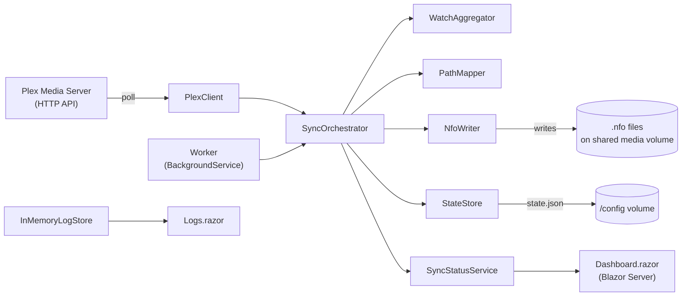

# Architecture

This document describes how PlexToJellyfinSync is put together and, where the reasoning is
recoverable from the code or existing docs, *why* it looks the way it does. It complements
[`README.md`](../README.md) (setup and configuration), [`CONTRIBUTING.md`](CONTRIBUTING.md)
(workflow) and [`UNIT_TESTS.md`](UNIT_TESTS.md) (test conventions) rather than repeating them.

---

## High-level shape

A single process ships as one Docker image: an ASP.NET Core / Blazor Server host whose only
background job is the `Worker` hosted service. There is no separate API tier, database, or
message queue — configuration, state, and in-memory status/log buffers are all the persistence
the application needs.

Project references form a straight line, `Core ← Data ← Service ← host`, except the host project
depends on `Core` and `Service` but **not** on `Data` directly — the Plex JSON DTOs never need to
be visible outside `PlexToJellyfinSync.Service`, which is the only project that talks to the Plex
API. Every project links the same `src/GlobalSuppressions.cs` (SonarCloud suppressions for
`S1125`, `S2325`, `S1244`, `S6968`) rather than each carrying its own.

The solution file is `.slnx` rather than the legacy `.sln` format — this is the current Visual
Studio standard for solution files, not a migration artifact.

---

## Sync pipeline

1. **`Worker`** (`src/PlexToJellyfinSync/Worker.cs`) is the only `BackgroundService`. On startup
   it runs one reconcile immediately (`SafeReconcileAsync`, errors logged and swallowed so a
   failed first reconcile does not crash the host), then loops: wait `Sync:PollIntervalSeconds`
   (minimum 5s), call `ISyncOrchestrator.ProcessHistoryAsync`, and — once
   `Sync:FullReconcileIntervalHours` (minimum 1h) has elapsed since the last reconcile — call
   `ISyncOrchestrator.ReconcileAsync` again. The loop is a plain `while` with `Task.Delay`, not a
   `PeriodicTimer`; overlapping runs cannot occur because each iteration awaits the previous sync
   call to finish before scheduling the next delay.
2. **`SyncOrchestrator`** (`src/PlexToJellyfinSync.Service/SyncOrchestrator.cs`) implements both
   sync strategies:
   - **`ProcessHistoryAsync`** (incremental, cheap, runs every poll) reads the persisted
     high-water mark from `IStateStore`, calls `IPlexClient.GetHistorySinceAsync` for entries
     newer than that mark for the configured owner account, writes/updates the NFO for each
     affected item via `WriteItemAsync`, then advances the high-water mark to the latest
     `ViewedAt` seen. On the very first run (no persisted high-water mark yet), it seeds the mark
     to "now" and returns without processing anything — this deliberately avoids replaying the
     owner's entire watch history as a flood of NFO writes on first startup.
   - **`ReconcileAsync`** (full, expensive, runs on startup and periodically) walks every
     configured Plex library (filtered by `Plex:Libraries` if set) and writes/updates the NFO for
     every movie or episode found, regardless of watch state. This is the catch-up path for
     changes `ProcessHistoryAsync` cannot see — for example items marked watched through means
     that do not produce a Plex history entry.
   - Both paths funnel through `WriteItemAsync`, which resolves the local path via `IPathMapper`
     and skips the item (with a log warning) if no mapping matches or the item has no file path.
   - When `Sync:WriteSeriesSeasonAggregates` is enabled, both paths additionally call
     `UpdateSeriesAggregatesAsync` for every show touched by the run: it re-fetches all episodes of
     that show, aggregates their `WatchInfo` per season and for the whole series via
     `WatchAggregator`, and writes `season.nfo` / `tvshow.nfo` next to the episode files.
   - Both entry points catch and log unexpected exceptions (`HandleError`) rather than letting
     the `Worker` loop die, and always reset `SyncStatusViewData.IsRunning` in a `finally` block.
     `OperationCanceledException` is re-thrown so host shutdown is not swallowed as an error.
3. **`WatchAggregator`** (`src/PlexToJellyfinSync.Service/WatchAggregator.cs`) has one job:
   given a collection of `WatchInfo`, return `Watched = true` only if every child is watched, and
   `LastPlayed` as the maximum across children. It is the single source of truth for how season-
   and series-level watch state is derived from episodes.
4. **`PlexClient`** (`src/PlexToJellyfinSync.Service/PlexClient.cs`) is the only component that
   talks to the Plex HTTP API (`GET /accounts`, `/library/sections`,
   `/status/sessions/history/all`, `/library/metadata/{key}`, `/library/metadata/{key}/allLeaves`,
   `/library/sections/{key}/all`). It maps the raw `PlexToJellyfinSync.Data.Plex` DTOs
   (`PlexMetadata`, `PlexDirectory`, …) into the domain model (`MediaItem`, `PlexLibrary`,
   `PlexHistoryEntry`, `WatchInfo`) used by the rest of the app, so Plex's JSON shape never leaks
   past this class. `GetOwnerAccountIdAsync` prefers the configured `Plex:OwnerAccountId`; only
   when that is unset does it query `/accounts` and fall back to account id `1` if that call
   fails, so a misconfigured or unreachable Plex server never blocks startup.
5. **`PathMapper`** (`src/PlexToJellyfinSync.Service/PathMapper.cs`) rewrites the Plex-reported
   file path prefix into this container's local mount point using the longest matching
   `PathMappings` entry. It explicitly rejects paths containing `/../` or ending in `/..` before
   matching — the file path is one part of the Plex response that flows fairly directly into a
   filesystem write path (via `NfoWriter`), so this check exists to prevent a crafted or
   corrupted Plex path from mapping outside the intended media root. **A matching mapping is
   mandatory**: unmapped paths return `null` and are skipped rather than passed through
   unchanged, even when the container's mount point happens to equal the Plex-reported path (see
   the identity-mapping note in `README.md`).
6. **`NfoWriter`** (`src/PlexToJellyfinSync.Service/NfoWriter.cs`) is the only component that
   touches `.nfo` files on disk:
   - Target path resolution depends on `MediaKind`: `movie.nfo` or `<video>.nfo` for movies
     (per `Nfo:MovieFilenameStrategy` — `PreferExistingMovieNfo` checks for an existing
     `movie.nfo` on disk and falls back to the video's own name), `<video>.nfo` for episodes,
     `season.nfo` for seasons, `tvshow.nfo` for series.
   - If the target file exists, it is parsed with `XDocument` (`LoadOptions.PreserveWhitespace`)
     and only the `watched` / `playcount` / `lastplayed` elements are updated in place —
     `SetChild` compares the existing value first so a write is skipped entirely
     (`NfoWriteOutcome.Skipped`) when nothing actually changed. This is why the README can
     promise that "existing `.nfo` files are left untouched except for the watch fields": every
     other element is only ever written once, at file-creation time in `BuildDocument`, and never
     touched again on an update pass.
   - If the file does not exist and `Sync:CreateMissingNfo` is `true`, a full `BuildDocument` is
     built from the `MediaItem` (title, plot, genres, unique ids with a Plex-native `type`
     attribute, `premiered`/`aired`, `dateadded` for movies, …) and written with indentation; an
     existing file being merely updated is saved *without* re-indenting, so `XDocument`'s
     `PreserveWhitespace` load/save round-trip does not reformat content a human or another tool
     may have hand-edited.
   - Output is UTF-8 without a byte-order mark (`_utf8NoBom`), matching what Jellyfin's NFO
     reader expects.
7. **`StateStore`** (`src/PlexToJellyfinSync.Service/State/StateStore.cs`) persists exactly one
   value — the incremental high-water mark — to `state.json` under `State:Directory` (`/config`
   in the container). Reads and writes both go through a `SemaphoreSlim(1, 1)` gate so concurrent
   calls (there should only ever be one, from `Worker`, but the guard is cheap insurance) cannot
   interleave a read-modify-write. A missing or corrupt state file is treated as "no high-water
   mark yet" rather than a fatal error.
8. **`SyncStatusService`** (`src/PlexToJellyfinSync.Service/SyncStatusService.cs`) holds one
   mutable `SyncStatusViewData` behind a `Lock`, exposes immutable snapshots via `GetSnapshot()`,
   and raises a `Changed` event on every `Update()` so the Blazor dashboard can re-render without
   polling. `/health` and `Dashboard.razor` both read through this same snapshot.

---

## Web host & dashboard

- **`Program.cs`** (`src/PlexToJellyfinSync/Program.cs`) is the composition root: it adds
  environment variables under the `PLEXSYNC__` prefix (double underscore = configuration section
  nesting, the standard ASP.NET Core convention), registers `Worker` as a hosted service,
  registers `InMemoryLogProvider` as an `ILoggerProvider` so every `ILogger<T>` call in the app
  also lands in the dashboard's log buffer, and always maps `GET /health` (unauthenticated,
  reports `plexConnected`/`isRunning`/`lastPollAt`/`lastReconcileAt`/`errors` from the status
  snapshot) regardless of whether the dashboard itself is enabled.
- Every response gets a small fixed set of security headers (`X-Content-Type-Options`,
  `X-Frame-Options: DENY`, HSTS, and a `Content-Security-Policy`). The CSP allows
  `'unsafe-inline'` for script/style and `wss:`/`ws:` for `connect-src` — both are required for
  Blazor Server's SignalR circuit and inline bootstrap script, not a relaxed default; every other
  source is restricted to `'self'`.
- **`Dashboard:Enabled`** gates the entire interactive surface: when `false`, only `/health` is
  mapped and nothing else (no Razor components, no login endpoints, no antiforgery/status-code
  middleware) — there is no dashboard to secure in that mode. When `true`, the pipeline adds
  `UseAntiforgery`, `TokenAuthMiddleware`, the Razor component endpoints
  (`AddInteractiveServerRenderMode`), and the `/login` GET/POST endpoints.
- **`TokenAuthMiddleware`** (`src/PlexToJellyfinSync/Security/TokenAuthMiddleware.cs`) is a
  no-op pass-through when `Dashboard:Token` is unset — the dashboard is unauthenticated by
  default, consistent with `SECURITY.md`'s framing of this as a home-network tool. When a token
  is configured, every request except `/health`, `/login`, framework-internal paths (`/_...`,
  e.g. Blazor's `/_blazor` SignalR endpoint) and requests for a static file (last path segment
  contains a `.`) must carry a session cookie (`pjf_auth`) that resolves to a live entry in
  `IMemoryCache`. Sessions are therefore server-side and revocable by cache eviction, not
  self-contained bearer tokens.
- **`DashboardLoginService`** (`src/PlexToJellyfinSync.Service/Security/DashboardLoginService.cs`)
  compares the submitted token to the configured one via `TokenComparer.FixedTimeEquals` — both
  inputs are SHA-256-hashed first (removing any length side-channel) before a constant-time
  `CryptographicOperations.FixedTimeEquals` on the hashes — and, on success, mints a 256-bit
  random session id (`RandomNumberGenerator`). Failed attempts go through `LoginThrottle`
  (`src/PlexToJellyfinSync.Service/Security/LoginThrottle.cs`): the first 5 failures per client
  key (remote IP) are free, after which each further failure doubles an exponential-backoff
  lockout (1s base, capped at 5 minutes). Entries idle longer than 15 minutes reset their failure
  count on the next attempt, and the tracked-client map is pruned once it exceeds 1024 entries —
  bounding memory use without a background sweep timer. **`LoginEndpoints.HandleLoginAsync`**
  (`src/PlexToJellyfinSync/Security/LoginEndpoints.cs`) is the HTTP glue: on `LockedOut` it
  returns `429` with a `Retry-After` header; on `Succeeded` it stores the session id in
  `IMemoryCache` under `pjf_session:<id>` with an 8-hour sliding lifetime and sets the
  `pjf_auth` cookie as `HttpOnly, Secure, SameSite=Strict`; on `Failed` it redirects back to
  `/login?error=1`.
- **`Dashboard.razor`** subscribes to `ISyncStatusProvider.Changed` in `OnInitialized` and
  unsubscribes in `Dispose`, re-rendering via `InvokeAsync(StateHasChanged)` whenever the
  orchestrator updates the status — the dashboard is push-updated, not polling. **`Logs.razor`**
  follows the same pattern against `ILogStore`/`InMemoryLogStore`, which is a fixed-capacity
  (`Dashboard:LogBufferSize`) ring buffer (`Queue<LogEntry>` behind a `Lock`) rather than
  unbounded storage — log history is intentionally ephemeral and capped, not a substitute for an
  external log sink.

---

## Configuration & dependency injection

- **`ServiceCollectionExtensions.AddPlexToJellyfinSync`**
  (`src/PlexToJellyfinSync.Service/ServiceCollectionExtensions.cs`) is the single DI registration
  point for everything under `PlexToJellyfinSync.Service`: it binds every `Options` class to its
  configuration section, registers every service as a singleton (the whole pipeline is one
  sequential background worker — there is no per-request or per-scope service in the sync path),
  and configures the `PlexClient` `HttpClient` (base address, `X-Plex-Token` header, `Accept:
  application/json`, 30s timeout) via `AddHttpClient<IPlexClient, PlexClient>`.
- All options classes live in `PlexToJellyfinSync.Core.Options` and bind to a `SectionName`
  matching their configuration key (`Plex`, `Sync`, `Nfo`, `State`, `Dashboard`); `PathMappings`
  binds directly to `List<PathMapping>` at the configuration root rather than through a named
  options section, which is why it appears as `PathMappings:N:Plex`/`:Local` rather than nested
  under another key. See `README.md` for the full configuration key/env-var/default table.

---

## Deployment

- Single multi-stage `Dockerfile` at the repo root: `dotnet/sdk:10.0-alpine` build stage restores
  and publishes `src/PlexToJellyfinSync`, then copies the publish output onto
  `dotnet/aspnet:10.0-alpine` (pinned by digest, with the tag kept alongside for readability).
  `ASPNETCORE_URLS` is fixed to `http://+:8080` inside the container; the host maps that internal
  port to whatever external port it chooses.
- The image expects two volumes: a **writable** media volume (so `NfoWriter` can create/update
  `.nfo` files next to the media) and a `/config` volume for `StateStore`'s `state.json`.
- **CI** (`.github/workflows/ci.yml`) restores, runs `reihitsu-format --check ./` (with the CLI
  installed via `--prerelease` so it matches the pinned analyzer) and fails the build on any
  unformatted file, builds, runs tests with coverage
  (`XPlat Code Coverage`, OpenCover format), and — when `SONAR_TOKEN` is available (not exposed to
  Dependabot or fork PRs) — feeds the coverage into SonarQube Cloud analysis
  (`networlddev_PlexToJellyfinSync`).
- **CodeQL** (`.github/workflows/codeql.yml`) runs on push/PR to `main` and weekly on a schedule,
  analyzing both C# and JavaScript/TypeScript in `build-mode: none` (no compiled build needed for
  CodeQL's extraction).
- **Dependabot** (`.github/dependabot.yml`) checks weekly for `github-actions`, `nuget`, and
  `docker` updates, each grouped into a single PR per ecosystem (capped at 10 open PRs) instead of
  one PR per dependency.
- **Release** (`.github/workflows/release.yml`) triggers only when a PR closes merged into
  `main`. It diffs the merged PR's changed files against an exclusion list (`*.md`, `docs/`,
  `.github/`, `.claude/`, `tests/`, `LICENSE`, `.gitignore`, `.gitattributes`, `.editorconfig`)
  and skips the release entirely if nothing image-relevant changed — a docs-only or test-only PR
  does not publish a new image or tag. Otherwise it computes the next semantic version from the
  latest `v*` tag: **minor** bump (reset patch to 0) when the relevant change touches more than 5
  files or more than 100 changed lines, **patch** bump otherwise; **the major version is never
  bumped automatically**. It then tags `main`, builds and pushes a multi-arch
  (`linux/amd64,linux/arm64`) image to Docker Hub
  (`networlddev/plextojellyfinsync:<version>` and `:latest`), and creates a GitHub release with
  auto-generated notes plus the `docker pull` command for that version.

---

## AI agent instructions

Several files carry near-duplicate project guidance for different AI tools:
[`CLAUDE.md`](../CLAUDE.md) (Claude Code), [`AGENTS.md`](../AGENTS.md) (Codex/generic agents), and
[`.github/copilot-instructions.md`](../.github/copilot-instructions.md) (GitHub Copilot), plus
per-workflow skill files under `.claude/skills/` and `.github/skills/` (kept identical between
the two locations) that encode the create-PR, fix-issue and review-PR workflows in more procedural
detail. All of these are meant to stay consistent with each other and with this document,
`CONTRIBUTING.md` and `UNIT_TESTS.md` — a change to project conventions should be reflected in
every one of them, not just the one the current tool happens to read.

---

## Undocumented decisions

If a future change introduces a decision without a stated reason, add it here instead of leaving
the gap for the next person. None are currently outstanding.
